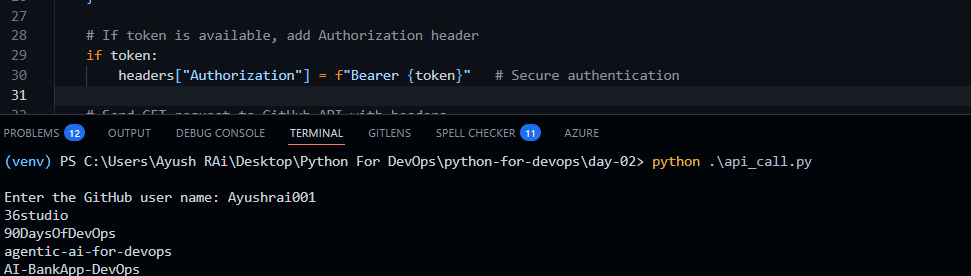

✅ 📄 README.md (With Screenshot Section)
# 🚀 Day 02 – Automating System Tasks with Python

## 📌 Task Overview

This task focuses on using Python to interact with APIs and work with JSON data.

The goal is to automate data fetching instead of performing tasks manually.

---

## ⚙️ What I Built

I created a Python script that:

- Takes a GitHub username as input  
- Calls the GitHub API  
- Fetches repository data  
- Extracts repository names  
- Prints output in the terminal  
- Saves output into a JSON file  

---

## 🛠️ Technologies Used

- Python  
- Requests Library  
- JSON  

---

## 📂 Project Structure


day-02/
│── api_call.py
│── output.json
│── README.md


---

## ▶️ How to Run

1. Clone the repository:
```bash
git clone https://github.com/YOUR_USERNAME/YOUR_REPO_NAME.git
Navigate to folder:
cd day-02
Install dependency:
pip install requests
Run the script:
python api_call.py
📸 Screenshots
🖥️ Terminal Output



repo-1
repo-2
repo-3
📄 JSON Output File

Add your JSON output screenshot here

[
  "repo-1",
  "repo-2",
  "repo-3"
]
📊 Output
Repository names printed in terminal
Data saved in output.json
🧠 Key Learnings
How to call APIs using Python
How to parse JSON responses
How to extract useful data
Basics of automation in DevOps
🚀 Why This Matters

Modern DevOps is API-driven:

Cloud services
CI/CD pipelines
Monitoring tools

Understanding APIs helps automate real-world tasks.

🙌 Credits

Thanks to Shubham Londhe (TrainWithShubham) for guidance and insights on automation.

🔗 Repository Link

https://github.com/YOUR_USERNAME/YOUR_REPO_NAME


---

## 📸 How to Add Actual Screenshots (Important)

1. Create a folder in your repo:

images/


2. Add screenshots like:

images/terminal.png
images/output.png


3. Replace this:
```md
_Add your terminal screenshot here_

👉 With:


👉 And:


